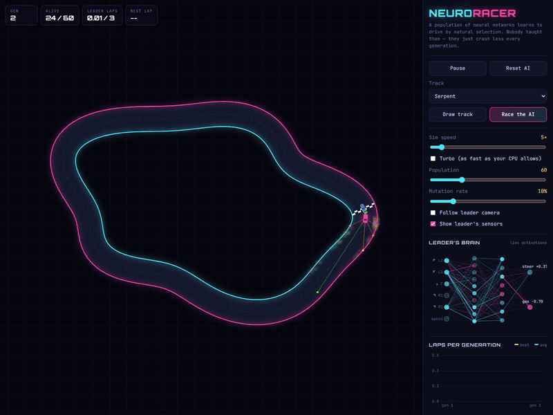
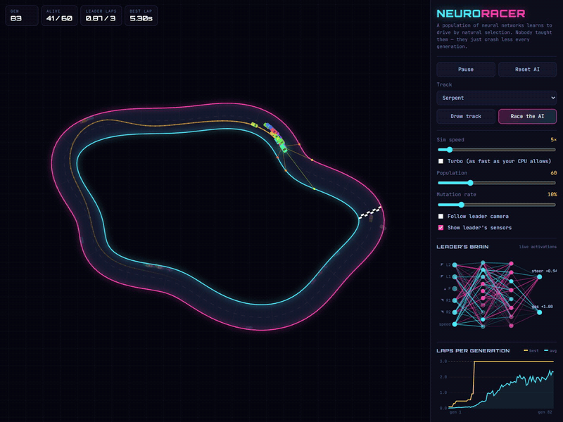
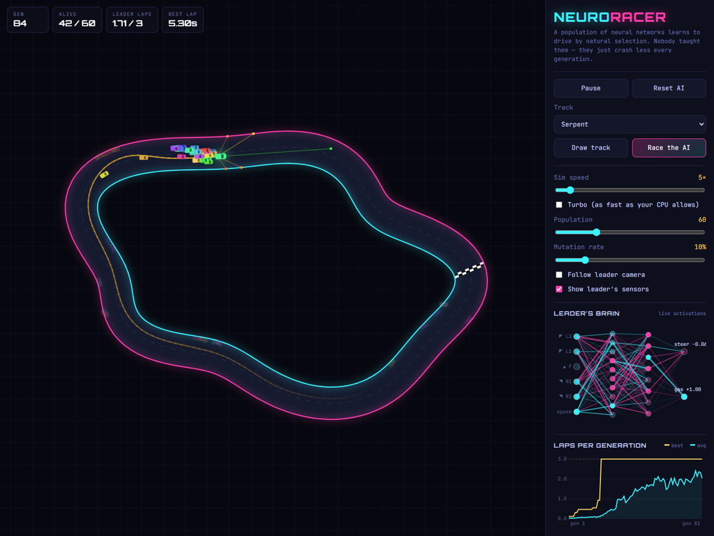
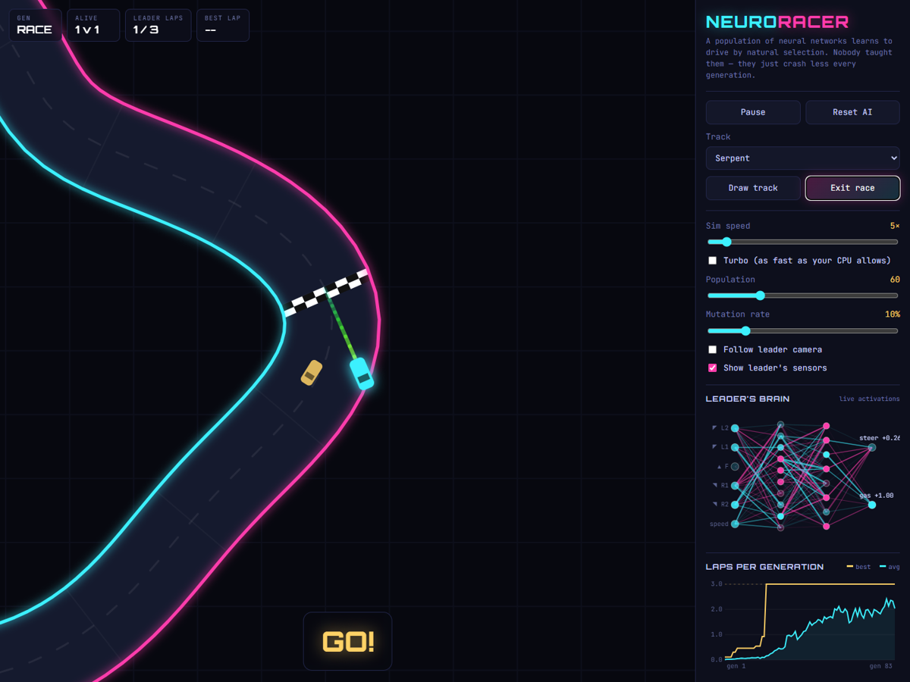
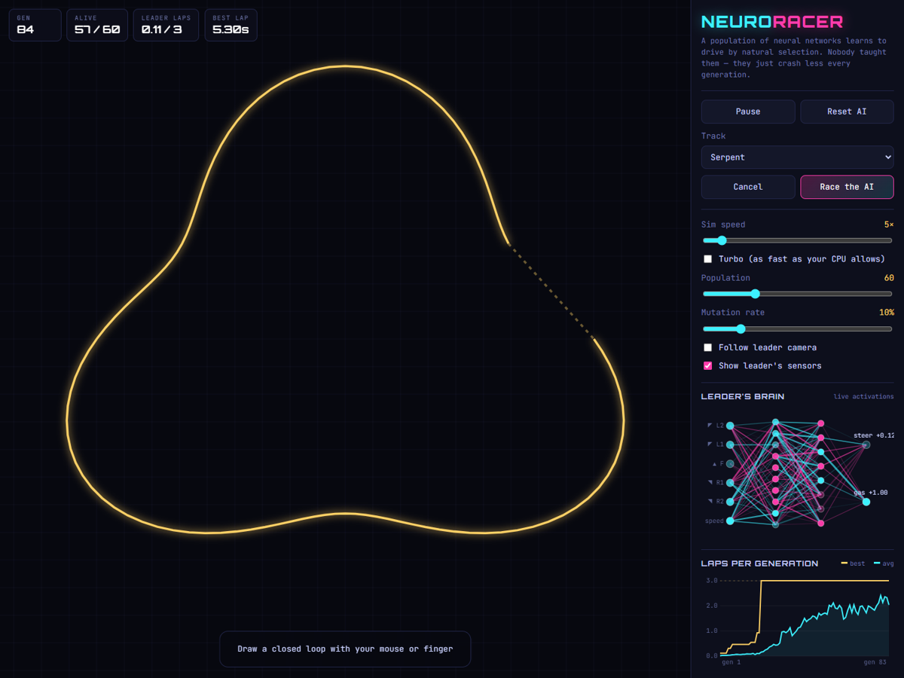
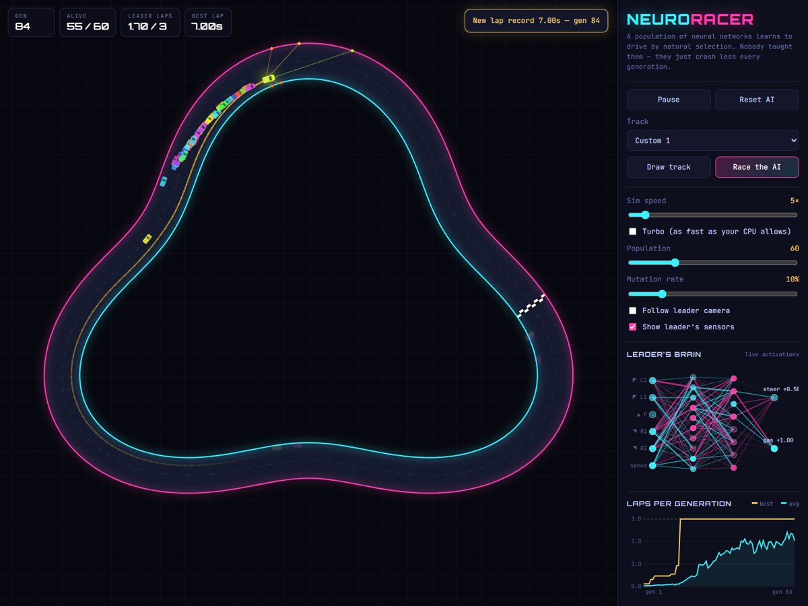

# ai-car — Neuro Racer

A population of neural networks learns to drive by natural selection. Nobody teaches them — they just crash less every generation.

Pure vanilla JavaScript + HTML canvas. No frameworks, no ML libraries — the neural net, genetic algorithm, ray-casting and car physics are all written from scratch.

## Demo

| Generation 1–4: random brains | Generation ~80: trained drivers |
| --- | --- |
|  |  |

Within a few dozen generations the best car completes all 3 laps, and the population average keeps climbing — visible in the *Laps per generation* chart:



### Race the AI



### Draw your own track

| Sketch a loop | The AI drives it |
| --- | --- |
|  |  |

## Run it

No build step. Open `index.html` in a browser, or serve the folder:

```sh
npx serve .
# or
python -m http.server
```

## How it works

**Brain** — each car is driven by a small feed-forward network (`6 → 10 → 8 → 2`, tanh activations).
- Inputs: 5 distance-ray sensors + current speed
- Outputs: steering and throttle

**Fitness** — progress along the track, with a bonus for average speed and a large bonus for finishing 3 laps.

**Evolution** — after each generation:
- The top 2 cars (elites) carry over unchanged
- Parents are chosen by tournament selection
- Neuron-level crossover: each neuron's incoming weights + bias come from one parent
- Gaussian mutation adds variation
- One fresh random brain is injected to keep diversity

**Physics** — acceleration, braking, drag and a grip model so cars can slide through corners.

## Features

- Multiple built-in tracks, or **draw your own** and watch the AI learn it from scratch
- **Race the AI** yourself against the current champion
- Live view of the leader's **brain activations** and **sensor rays**
- **Laps-per-generation chart** (best and average)
- Adjustable sim speed, turbo mode, population size and mutation rate
- Follow-leader camera
- **Save / load champion** (stored in browser localStorage)

## Controls

| Key | Action |
| --- | --- |
| Space | Pause / resume |
| Arrows / WASD | Drive (race mode) |
| R | Rematch (race mode) |
| Esc | Exit race mode |

## Project structure

```
index.html      UI layout
style.css       Styling
js/nn.js        Neural network (forward pass, mutation, crossover)
js/ga.js        Genetic algorithm / population
js/car.js       Car physics, sensors, fitness
js/track.js     Track generation, resampling and smoothing
js/render.js    Canvas rendering, brain view, fitness chart
js/main.js      Game loop, modes and UI wiring
```
